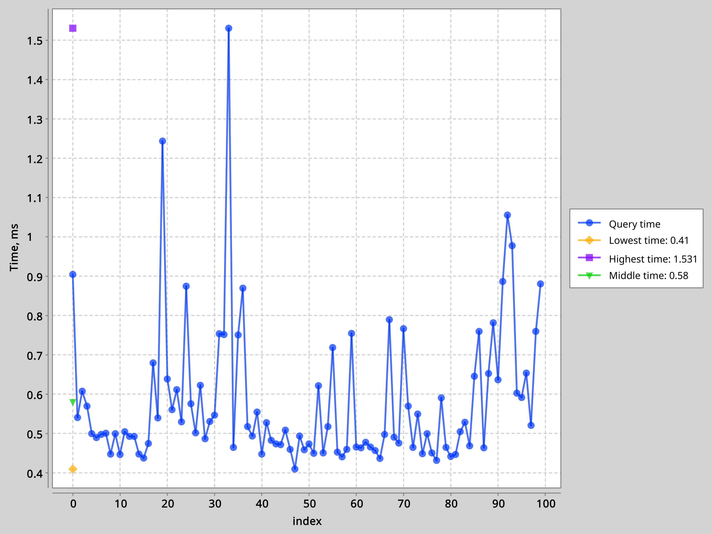
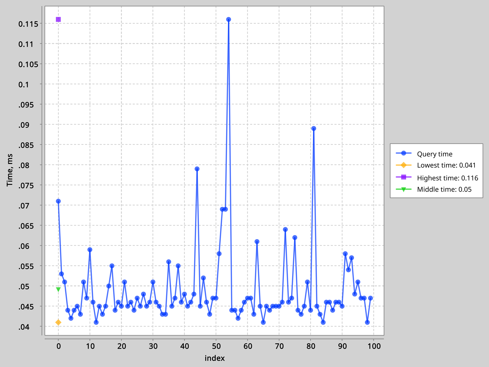
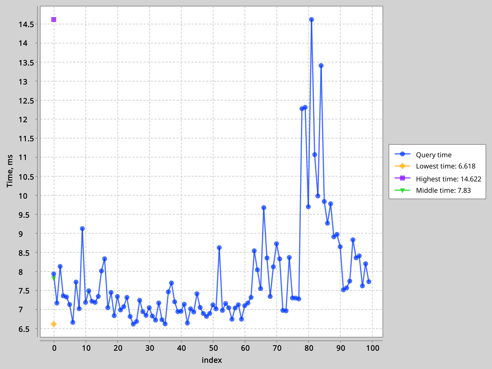
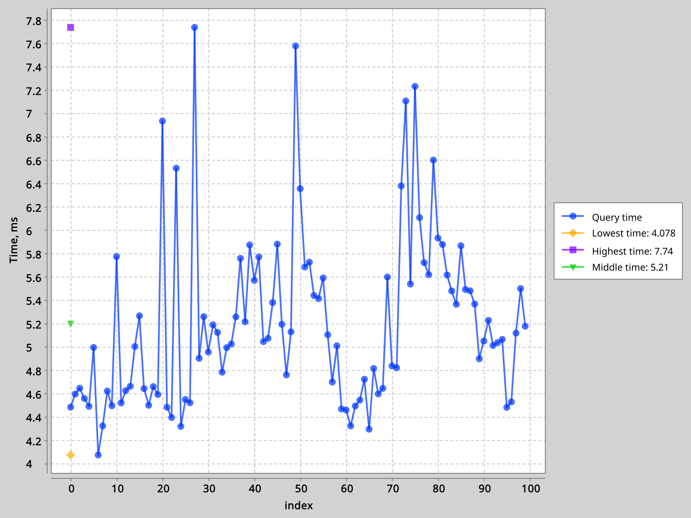
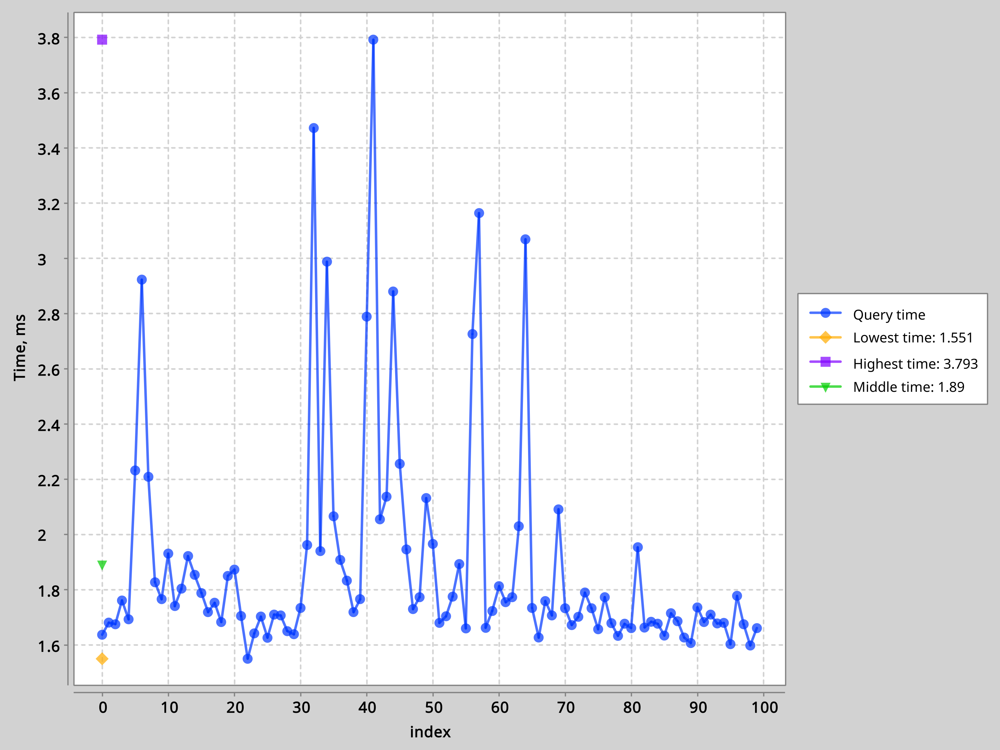
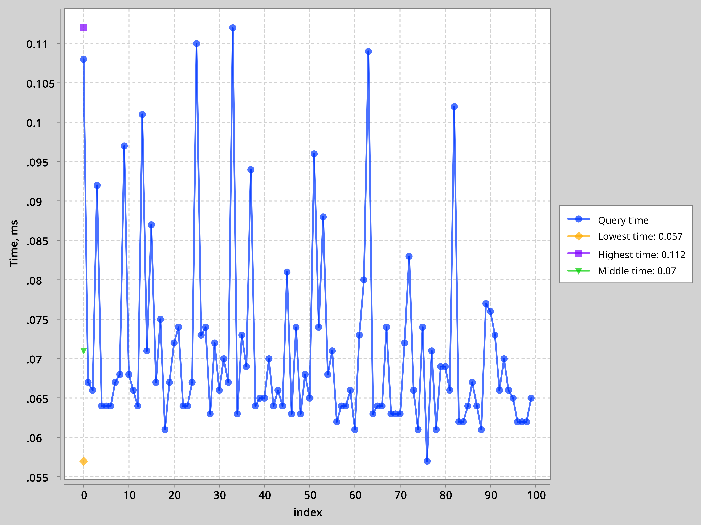
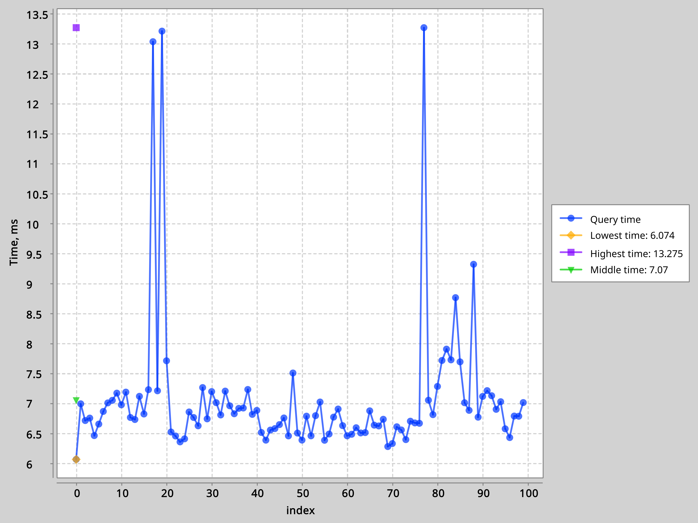
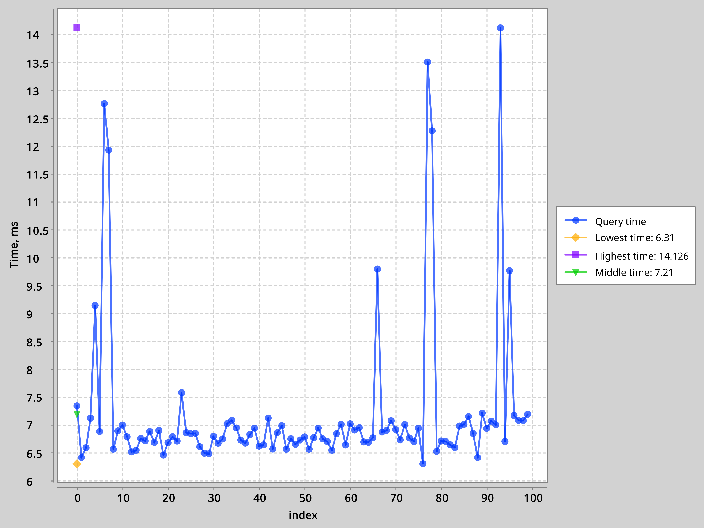

# WhooshDB

## Функциональные требования.
### Авторизация: 
> Доступ к сервису осуществляется через введение номера телефона и кода подтверждения.

### Оплата:
> Платежи автоматически списываются с привязанного к аккаунту банковского счета. Есть возможность изменить счет или добавить альтернативные варианты оплаты.

### Поддержка пользователей:
> Сервис обеспечивает круглосуточную поддержку через чат, где можно получить ответы на любые вопросы.

### Промокоды:
> Пользователи могут использовать промокоды для получения скидок на будущие поездки. Есть промокоды двух типов: общие (могут быть использованые любыми пользователем по одному разу) и одноразовые (уникальные)ю

### Подписки:
> Предлагаются подписки, позволяющие снизить стоимость поездок. Варианты подписок различаются по срокам действия и стоимости.

### Выбор самокатов:
> На онлайн-карте отображаются доступные самокаты. Карта показывает текущее местоположение пользователя, зоны с ограничениями и парковочные зоны.

### Профиль пользователя:
> Профиль связан с номером телефона. Предусмотрена возможность изменения электронной почты для получения чеков и уведомлений.

### История поездок:
> В истории сохраняются данные о каждой поездке, включая время, маршрут и стоимость.

## UML схема:

## Показатели производительности без индексации и с индексацией:

### 1. Отобразить все заказы конкретного пользователя, где пользователь - параметр.

    

        
        
Без индексации

    

    

        
        
С индексацией

    

### 2. Показать количество активных пользователей за месяц в течение последних 5 лет.

    

        
        
Без индексации

    

    

        
        
С индексацией

    

### 3. Показать все сообщения из определенного респонса и отсортировать их по времени.

    

        
        
Без индексации

    

    

        
        
С индексацией

    

### 4. Вывести все самокаты в определенной области.

    

        
        
Без индексации

    

    

        
        
С индексацией

    

### 5. Показать топ 100 пользователей, потративших наибольшее количество денег.

    

        
        
Без индексации

    

    

        
        
С индексацией

    

